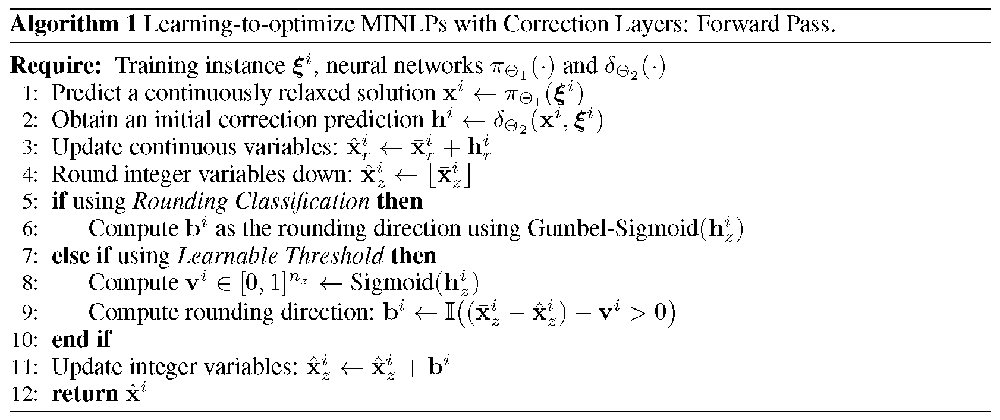
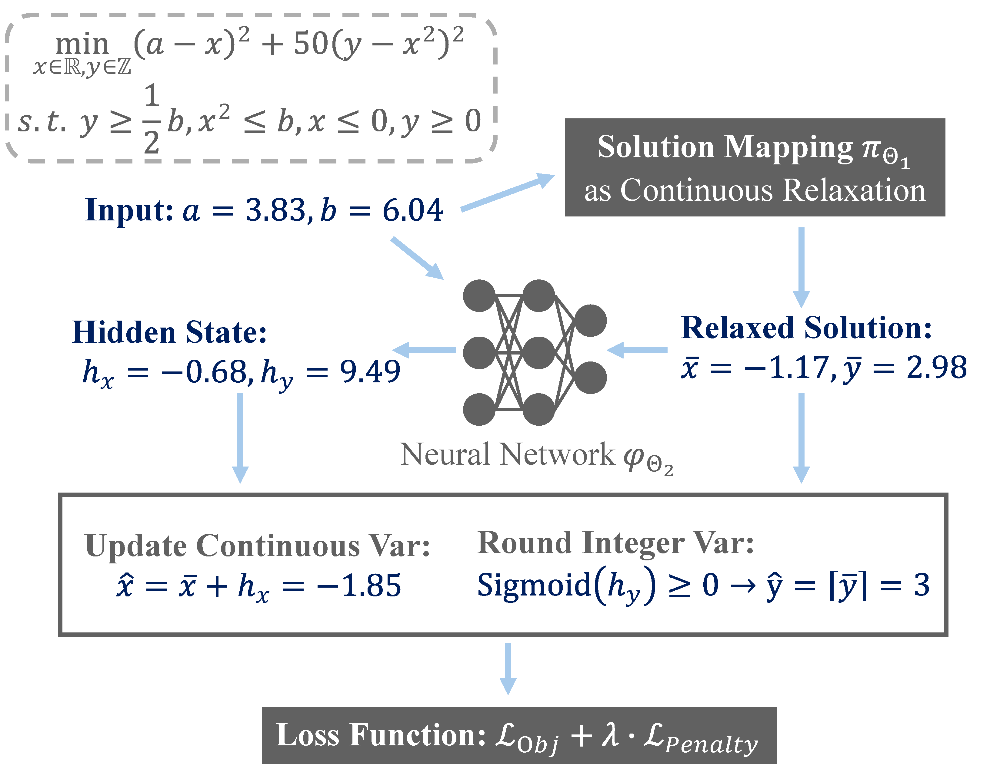

# Learning to Optimize for Mixed-Integer Nonlinear Programming


Mixed-integer nonlinear programs (MINLPs) arise in various domains, such as energy systems and transportation, but are notoriously difficult to solve. Recent advances in machine learning have achieved remarkable success in optimization tasks, an area known as learning to optimize. This approach includes using predictive models to generate solutions for optimization problems with continuous decision variables, thereby avoiding the need for computationally expensive optimization algorithms. However, applying learning to MINLPs remains challenging primarily due to integer decision variables, which complicate gradient-based learning. To address this limitation, we propose two differentiable correction layers that generate integer outputs while preserving gradient information. The experiments demonstrate that the proposed learning-based approach consistently produces high-quality solutions for parametric MINLPs extremely quickly. As problem size increases, traditional exact solvers and heuristic methods struggle to find feasible solutions, whereas our approach continues to deliver reliable results. Our work extends the scope of learning-to-optimize to MINLP, paving the way for integrating integer constraints into deep learning models.

## Contribution

Our contributions are as follows:

- We study the learning-to-optimize problem in the context of parametric MINLP (pMINLP), enabling, for the first time, quick, dynamic solution generation as problem parameters change.
- We propose two novel differentiable correction layers that effectively handle the non-differentiability of integer outputs in deep learning models. Combined with a penalty method for soft constraint satisfaction, we are able to learn a neural network mapping from instance parameters to solutions through gradient-based learning. Not only does this yield an extremely fast heuristic at test time, but the method is also self-supervised and thus efficiently trainable.
- We conduct extensive experiments on three problem classes from the literature: a convex integer quadratic problem, a nonconvex integer problem, and a nonconvex mixed-integer problem. Our learning-based methods consistently yield high-quality, feasible solutions extremely fast, outperforming exact solvers and heuristics. For the largest test instances we consider, the baselines fail to produce any solutions, whereas our methods continue to generate good, feasible solutions in most instances.

## Requirements

To run this project, you will need the following libraries and software installed:

- **Python**: The project is developed using Python. Ensure you have Python 3.9 or later installed.
- **Scikit-Learn**: Useful for performing various machine learning tasks.
- **PyTorch**: Used for building and training neural network models.
- **NumPy**: Essential for numerical operations.
- **Pandas**: Useful for data manipulation and analysis.
- **Pyomo**: A Python library for optimization modeling.
- **SCIP**: A powerful solver for mathematical programming, which might need a separate installation process.
- **Neuromancer**: This project uses the Neuromancer library for differentiable programming.

## Code Structure

```
├── img                            # Image resources for the project
├── src                            # Main source code directory
│   ├── __init__.py                # Initializes the src package
│   ├── func                       # Directory for function modules
│       ├── __init__.py            # Initializes the function submodule
│       ├── layer.py               # Pre-defined neural network layers
│       ├── ste.py                 # Straight-through estimators for non-differentiable operations
│       └── rnd.py                 # Modules for differentiable and learnable rounding
│   ├── problem                    # Modules for the benchmark of constrained optimization
│       ├── __init__.py            # Initializes the problem submodule
│       ├── math_solver            # Collection of Predefined Gurobi / SCIP solvers
│           ├── __init__.py        # Initializes the mathematical solver submodule
│           ├── abc_solver.py      # Abstract base class for solver implementations
│           ├── quadratic.py       # Gurobi model for Integer Convex Quadratic problem
│           ├── nonconvex.py       # SCIP model for Integer Simple Nonconvex problem
│           └── rosenbrock.py      # SCIP model for Mixed-Integer Rosenbrock problem
│       └── neuromancer            # Collection of Predefined NeuroMANCER maps
│           ├── __init__.py        # Initializes the NeuroMANCER map submodule
│           ├── quadratic.py       # NeuroMANCER mapping for Integer Convex Quadratic problem
│           ├── nonconvex.py       # NeuroMANCER mapping for Integer Simple Nonconvex problem
│           └── rosenbrock.py      # NeuroMANCER mapping for Mixed-Integer Rosenbrock problem
│   └── utlis                      # Utility tools such as data processing and result test
│       ├── __init__.py            # Initializes the utility submodule
│       └── data.py                # Data processing file
│       └── solve_test.py          # Testing functions to evaluate optimization solution
├── run_qp.py                      # Script for training for Integer Convex Quadratic problem
├── run_nc.py                      # Script for training for Integer Simple Nonconvex problem
├── run_rb.py                      # Script for training for Mixed-Integer Rosenbrock problem
└── README.md                      # README file for the project
```

## Algorithms

We introduce the two differentiable correction layers designed to handle the integrality constraints of MINLPs.
They differ in how they round an integer variable's fractional value but are equally easy to train with gradient descent and fast at test time. We decompose the mapping from an instance parameter vector to a candidate mixed-integer solution into two steps.

<p align="center"></p>

1. The first step consists in applying a learnable **relaxed solution mapping** encoded by a deep neural network. It outputs a continuously relaxed solution without enforcing the integrality requirement. Note that continuous variables are also predicted in this first step.
2. The second step is a **differentiable correction layer** that takes as input the instance parameter vector and the continuous solution produced in the first step, and outputs a candidate mixed-integer solution while maintaining differentiability.

### Example for Rounding Classification

<p align="center"></p>

### Example for Learnable Threshold

<p align="center"></p>


## Parametric MINLP Benchmark

### Integer Convex Quadratic problem

The convex quadratic problems used in the experiments:

$$
\min_{x \in \mathbb{Z}^n} \ \frac{1}{2} \mathbf{x}^{\top} \mathbf{Q} \mathbf{x} + \mathbf{p}^{\top} \mathbf{x} \quad \text{subject to } \mathbf{A} \mathbf{x} \leq \mathbf{b}
$$

The variable parameter $\mathbf{b}$ follows a uniform distribution between $-1$ and $1$.

### Integer Simple Nonconvex problem

To explore the performance on nonconvex optimization tasks, we extended the convex quadratic programming problem by introducing a trigonometric term to the objective function:

$$
\min_{x \in \mathbb{Z}^n} \ \frac{1}{2} \mathbf{x}^{\top} \mathbf{Q} \mathbf{x} + \mathbf{p}^{\top} \sin{(\mathbf{x})} \quad \text{subject to } \mathbf{A} \mathbf{x} \leq \mathbf{b}
$$

The variable parameter $\mathbf{b}$ follows a uniform distribution between $-1$ and $1$.

### Mixed-Integer Rosenbrock problem

The parametric, high-dimensional mixed-integer Rosenbrock problem serves as a challenging testbed. Adapted from the classic Rosenbrock function, this formulation introduces additional complexity by incorporating integer variables, nonlinear constraints, and parametric variations in high dimensions. The problem can be expressed as follows:

$$
\begin{aligned}
\min_{\mathbf{x} \in \mathbb{R}^n, \mathbf{y} \in \mathbb{Z}^n} \quad 
& (\mathbf{a} - \mathbf{x})^\top (\mathbf{a} - \mathbf{x}) + 50 (\mathbf{y} - \mathbf{x}^2)^\top (\mathbf{y} - \mathbf{x}^2) \\
\text{subject to} \quad & \mathbf{x}^\top \mathbf{x} \leq n b,
\mathbf{1}^\top \mathbf{y} \geq \frac{nb}{2}, 
\mathbf{p}^\top  \mathbf{x} \leq 0,
\mathbf{q}^\top  \mathbf{y} \leq 0.
\end{aligned}
$$

The scalar parameter $p$ is uniformly distributed between $1$ and $8$, while the vector parameter $\mathbf{a}$, with length $b$, uniformly ranges from  $0.5$ and $4.5$.

## Code Example

Here is a simple example demonstrating learnable rounding within a neural network framework:

```Python
# get objective function & constraints
from src.problem import nmQuadratic
obj, constrs = nmQuadratic(["x_rnd"], ["p"], penalty_weight=10)

# define neural architecture for the solution map
import neuromancer as nm
func = nm.modules.blocks.MLP(insize=2, outsize=4, bias=True,
                             linear_map=nm.slim.maps["linear"],
                             nonlin=nn.ReLU, hsizes=[10]*4)
smap = nm.system.Node(func, ["p"], ["x"], name="smap")

# define rounding model using Gumbel binarization
from src.func.layer import netFC
layers_rnd = netFC(input_dim=6, hidden_dims=[20]*3, output_dim=4)
from src.func.rnd import roundGumbelModel
round_func = roundGumbelModel(layers=layers_rnd, param_keys=["p"], var_keys=["x"], output_keys=["x_rnd"],
                              bin_ind={"x":[2,3]}, continuous_update=False, name="round")


# construct the complete neuromancer problem with all components
components = [smap, round_func]
loss = nm.loss.PenaltyLoss(obj, constrs)
problem = nm.problem.Problem(components, loss)
```
