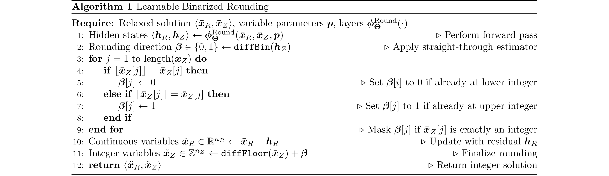
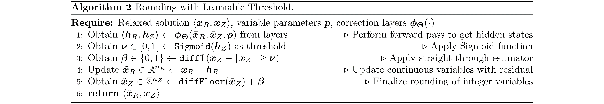

# Differentiable Mixed-Integer Programming Layers


This project is an implementation of Differentiable Mixed-Integer Programming Layers based on the [NeuroMANCER library](https://github.com/pnnl/neuromancer). It introduces learnable differentiable correction layers for rounding and projection, enabling efficient integer solution acquisition for parametric nonlinear mixed-integer problems through neural networks, thus eliminating the need for traditional mathematical programming solvers.

While inherently heuristic and not guaranteed to find the optimal or even a feasible solution, the framework often provides high-quality feasible solutions that are extremely useful either as alternatives to optimal solutions or as initial solutions for traditional solvers. This capability makes them invaluable tools in complex optimization scenarios where exact methods might struggle or be too slow.

## Features

- **Efficient Solution Acquisition**: The entire solution process relies entirely on neural networks without the need for mathematical programming solvers.

- **Integer Solution Guarantee**: Integrates learnable rounding directly into the network architecture, ensuring that solutions adhere strictly to integer constraints.

## Problem Definition

A generic formulation of a multiparametric mix-integer nonlinear program (pMINLP) is given in the form:

$$
\begin{aligned}
  \underset{\boldsymbol{\Theta}}{\min} \quad & \frac{1}{m} \sum_{i=1}^m f(\mathbf{x}^i_R, \mathbf{x}^i_Z, \boldsymbol{\xi}^i) \\ 
  \text{s.t.} \quad 
  & \mathbf{g} (\mathbf{x}^i_R, \mathbf{x}^i_Z, \boldsymbol{\xi}^i) \leq \mathbf{0} \quad \forall i \\ 
  & \mathbf{h} (\mathbf{x}^i_R, \mathbf{x}^i_Z, \boldsymbol{\xi}^i) = \mathbf{0} \quad \forall i \\ 
  & \mathbf{x}^i_R \in \mathbb{R}^{n_R} \quad \forall i \\ 
  & \mathbf{x}^i_Z \in \mathbb{Z}^{n_Z} \quad \forall i \\ 
  & [\mathbf{x}^i_R, \mathbf{x}^i_Z] = \boldsymbol{\pi}_{\boldsymbol{\Theta}} (\boldsymbol{\xi}^i) \quad \forall i \\ 
  & \boldsymbol{\xi}^i \in \boldsymbol{\Xi} \subset \mathbb{R}^s \quad \forall i 
\end{aligned}
$$

where $\boldsymbol{\Xi}$ represents the sampled dataset and $\boldsymbol{\xi}^i$ denotes the $i$-th sample. The vector $\mathbf{x}^i_R$ represents the continuous variables, and $\mathbf{x}^i_Z$ represents the integer variables, both of which are involved in minimizing the objective function $f(\cdot)$ while satisfying a set of inequality and equality constraints $\mathbf{g}(\cdot) \leq 0$ and $\mathbf{h}(\cdot) = 0$. The mapping $\boldsymbol{\pi}_{\boldsymbol{\Theta}}(\boldsymbol{\xi}^i)$, given by a deep neural network parametrized by $\Theta$, represents the solution to the optimization problem.

## Requirements

To run this project, you will need the following libraries and software installed:

- **Python**: The project is developed using Python. Ensure you have Python 3.9 or later installed.
- **Scikit-Learn**: Useful for performing various machine learning tasks. 
- **PyTorch**: Used for building and training neural network models.
- **NumPy**: Essential for numerical operations.
- **Pandas**: Useful for data manipulation and analysis.
- **Pyomo**: A Python library for optimization modeling.
- **SCIP**: A powerful solver for mathematical programming, which might need a separate installation process.
- **Neuromancer**: This project uses the Neuromancer library for differentiable programming.

## Code Structure

```
├── archive                        # Archive for older files and documents
├── img                            # Image resources for the project
├── src                            # Main source code directory
│   ├── __init__.py                # Initializes the src package
│   ├── func                       # Directory for function modules
│       ├── __init__.py            # Initializes the function submodule
│       ├── layer.py               # Pre-defined neural network layers
│       ├── ste.py                 # Straight-through estimators for non-differentiable operations
│       ├── rnd.py                 # Modules for differentiable and learnable rounding
│       └── proj.py                # Modules for differentiable and learnable projection
│   ├── problem                    # Modules for the benchmark of constrained optimization
│       ├── __init__.py            # Initializes the problem submodule
│       ├── math_solver            # Collection of Predefined SCIP solvers
│           ├── __init__.py        # Initializes the mathematical solver submodule
│           ├── abc_solver.py      # Abstract base class for solver implementations
│           ├── quadratic.py       # SCIP model for MIQP
│           └── rosenbrock.py      # SCIP model for MIRosenbrock
│       └── neuromancer            # Collection of Predefined NeuroMANCER maps
│           ├── __init__.py        # Initializes the NeuroMANCER map submodule
│           ├── quadratic.py       # NeuroMANCER map for MIQP
│           └── rosenbrock.py      # NeuroMANCER map for MIRosenbrock
│   └── utlis                      # Utility tools such as data processing and result test
│       ├── __init__.py            # Initializes the utility submodule
│       └── data.py                # Data processing file
│       └── solve_test.py          # Testing functions to evaluate optimization solution
├── sweep_QP-Round.py              # Script for hyperparameter tuning for MIQP
├── sweep_Rosenbrock-Round.py      # Script for hyperparameter tuning for MIRosenbrock
└── README.md                      # README file for the project
```

## Algorithms

### Rounding

These algorithms provide mechanisms for rounding within a differentiable programming framework, addressing the challenge of non-differentiable operations inherent in discrete optimization. They are crucial in scenarios where solutions must adhere to integer output with constraints.

The algorithm starts with a relaxed solution $\mathbf{x}^i_R, \mathbf{x}^i_Z$ which may come from a mathematical solver or a NeuroMANCER map, providing a baseline for further refinement. Correction layers then adjust this relaxed solution via rounding the integer variables $\mathbf{x}^i_R$ and updating continuous variables $\mathbf{x}^i_Z$ to minimize the Langrage penalty function.

During the training of neural networks, non-differentiable operations such as binarization, flooring, and indicator functions pose significant challenges for gradient-based optimization methods because these functions lost gradients. To avoid these issues, the straight-through estimator (STE) is employed. This approach allows the gradient of a rounded result to pass through unaltered from its input, effectively enabling optimization of functions that involve non-differentiable transformations.

#### Learnable Binarized Rounding



This algorithm is specifically designed to adaptively decide the rounding direction—whether to round up (ceiling) or down (floor)—for each variable based on the contextual data it processes.

The `diffGumbelBinarize`, as implemented, utilizes the Gumbel-Softmax distribution to introduce two Gumbel noises into the logits of 0 and 1 during the training. This approach simulates the randomness associated with rounding decisions, and by adjusting the `temperature` parameter, it controls the sharpness of the binarization, effectively balancing exploration and exploitation in the rounding process.

#### Rounding with Learnable Threshold



This algorithm introduces a dynamic, learnable threshold that determines the specific rounding behavior for each integer variable.

## Parametric MINLP Benchmark

### MIQP

A parametric MIQP model with both continuous variables $\mathbf{x}$ and binary variables $\mathbf{y}$ can be structured as follows:

$$
\begin{aligned}
  \underset{\boldsymbol{\mathbf{x}, \mathbf{y}}}{\min} \quad & \mathbf{c}^\top \mathbf{x} + \frac{1}{2} \mathbf{x}^\top \mathbf{Q} \mathbf{x} + \mathbf{d}^\top \mathbf{y} \\
  \text{s.t.} \quad 
  & \mathbf{A} \mathbf{x} + \mathbf{E} \mathbf{y} \leq \mathbf{b} + \mathbf{F} \mathbf{\theta} \\
  & \mathbf{x} \geq \mathbf{0} \\
  & \mathbf{y} \in \{0, 1\}
\end{aligned}
$$

In this formulation, the objective function is a quadratic function of $\mathbf{x}$ plus linear in both $\mathbf{x}$ and $\mathbf{y}$. The constraints involve linear combinations of these variables, while the right-hand sides are modulated by the parameter $\mathbf{\theta}$.

The fixed parameters of an example from [A multiparametric programming approach for mixed-integer quadratic engineering problems](https://www.sciencedirect.com/science/article/abs/pii/S0098135401007979), are defined as follows:

$$
\mathbf{c} = \begin{bmatrix}
    0.02 \\
    0.03
\end{bmatrix},
\quad
\mathbf{Q} = \begin{bmatrix}
    0.0196 & 0.0063 \\
    0.0063 & 0.0199
\end{bmatrix},
\quad
\mathbf{d} = \begin{bmatrix}
    -0.30 \\
    -0.31
\end{bmatrix}
$$

$$
\mathbf{b} = \begin{bmatrix}
    0.417425 \\
    3.582575 \\
    0.413225 \\
    0.467075 \\
    1.090200 \\
    2.909800 \\
    1.000000
\end{bmatrix},
\quad
\mathbf{A} = \begin{bmatrix}
    1 & 0 \\
    -1 & 0 \\
    -0.0609 & 0 \\
    -0.0064 & 0 \\
    0 & 1 \\
    0 & -1 \\
    0 & 0
\end{bmatrix};
$$

$$
\mathbf{E} = \begin{bmatrix}
    -1 & 0 \\
    -1 & 0 \\
    0 & -0.5 \\
    0 & -0.7 \\
    -0.6 & 0 \\
    -0.5 & 0 \\
    1 & 1
\end{bmatrix};
$$

$$
\mathbf{F} = \begin{bmatrix}
    3.16515 & 3.7546 \\
    -3.16515 & -3.7546 \\
    0.17355 & -0.2717 \\
    0.06585 & 0.4714 \\
    1.81960 & -3.2841 \\
    -1.81960 & 3.2841 \\
    0 & 0
\end{bmatrix}
$$

The variable parameter $\mathbf{\theta}$ follows a uniform distribution between $0$ and $1$.

### MIRosenbrock

The parametric, high-dimension, Integer, and constrained Rosenbrock problem implemented in this project serves as a rigorous testbed for evaluating the efficacy of our differentiable programming framework:

$$
\begin{aligned}
  \underset{\boldsymbol{\mathbf{x}}}{\min} \quad & \sum_{i=1}^b [{(a - x_{2i})}^2 + 100 {(x_{2i+1} - {x_{2i}}^2)}^2] \\
  \text{s.t.} \quad 
  & \sum_{i=1}^b x_{2i}^2 \leq b p \\
  & \sum_{i=1}^b x_{2i}^2 \geq \frac{b p}{2} \\
  & \mathbf{x} \in \mathbb{Z}^{2b} \\
\end{aligned}
$$

The scalar parameter $p$ is uniformly distributed between $1$ and $8$, while the vector parameter $\mathbf{a}$, with length $b$, uniformly ranges from  $0.5$ and $4.5$.


