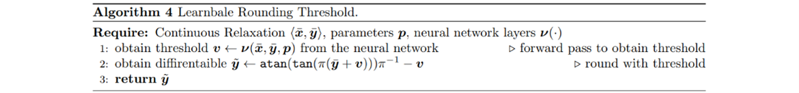
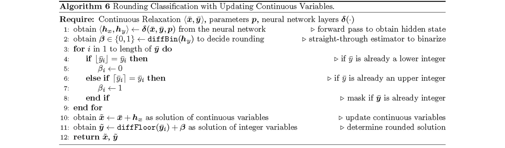
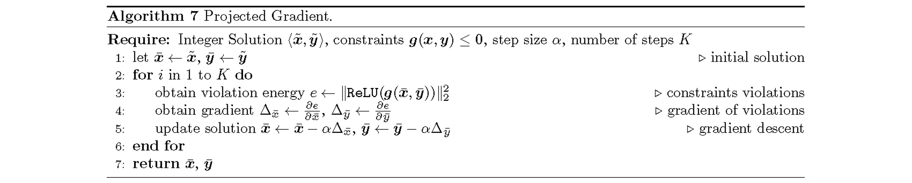
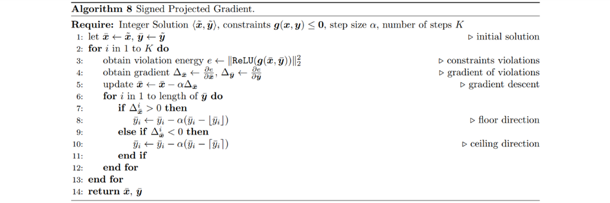
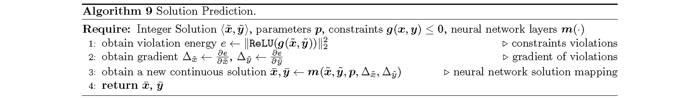
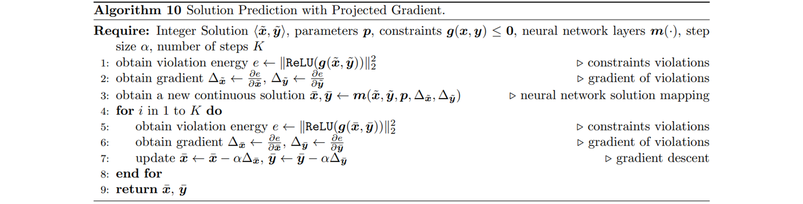
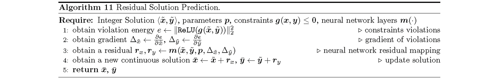

### Methods & Ablations

#### Rounding Steps:

|                             |                                    | **Init Sol from Continuous Solver** | **Init Sol from Fixed Predictor** | **End-to-end Training with Predictor** |
|-----------------------------|------------------------------------|-------------------------------------|-----------------------------------|----------------------------------------|
|                             | **Fixed Rounding Threshold (0.5)** | ✓                                   | ✓                                 | N/A                                    |
|                             | **Learnable Rounding Threshold**   |                                     |                                   |                                        |
| **Rounding Classification** | **with Fixed Continuous Vars**     | ✓                                   | ✓                                 | ✓                                      |
|                             | **with Updating Continuous Vars**  | ✓                                   | ✓                                 | ✓                                      |

##### Learnable Rounding Threshold:

##### Rounding Classification with Fixed Continuous Vars:

[Code](https://github.com/pnnl/DMIPL/blob/master/model/round.py#L7)

[Code with Gumbel-Softmax trick](https://github.com/pnnl/DMIPL/blob/master/model/round.py#L73)

Set ``continuous_update`` as ``False``.

##### Rounding Classification with Updating Continuous Vars:

[Code](https://github.com/pnnl/DMIPL/blob/master/model/round.py#L7)

[Code with Gumbel-Softmax trick](https://github.com/pnnl/DMIPL/blob/master/model/round.py#L73)

Set ``continuous_update`` as ``True``.

#### Projection Steps:

|                           |                       |                       | **Loss Function** |                                 | **Rounding**                    |                                     |
|---------------------------|-----------------------|-----------------------|-------------------|---------------------------------|---------------------------------|-------------------------------------|
|                           |                       |                       | **Sol Distance**  | **Sol Distance + Obj Function** | **Int Sol from Fixed Rounding** | **Trained with Learnable Rounding** |
| **Continuous Relaxation** |                       |                       | ✓                 |                                 | ✓                               | N/A                                 |
| **Proj Grad**             |                       |                       |                   |                                 |                                 |                                     |
| **Signed Proj Grad**      |                       |                       |                   |                                 |                                 |                                     |
| **NN Mapping**            | **Sol Pred**          | **without Proj Grad** |                   |                                 |                                 |                                     |
|                           |                       | **with Proj Grad**    |                   |                                 |                                 |                                     |
|                           | **Residual Sol Pred** | **without Proj Grad** |                   |                                 |                                 |                                     |
|                           |                       | **with Proj Grad**    |                   |                                 |                                 |                                     |

##### Projected Gradient: 

[Code](https://github.com/pnnl/neuromancer/blob/develop/src/neuromancer/modules/solvers.py#L45)

##### Signed Projected Gradient:

##### Solution Prediction:

##### Solution Prediction with Projected Gradient:

[Code](https://github.com/pnnl/DMIPL/blob/master/model/proj.py)

Set ``residual`` as ``False``.

##### Residual Solution Prediction:

##### Residual Solution Prediction with Projected Gradient:

[Code](https://github.com/pnnl/DMIPL/blob/master/model/proj.py)

Set ``residual`` as ``False``.

#### Others:

- Randomization: Randomly drop variable corrections during projected gradient.
- Parameters Sharing: Use the same rounding and projection layers for all unrolled iterations.
- Weights of Losses.
- Neural Network Hyperparameters.

### To-Do

- Datasets selection: [200 MINLPLib Instances](https://arxiv.org/pdf/2301.00587.pdf), [Wikipedia Test functions](https://en.wikipedia.org/wiki/Test_functions_for_optimization), [SurCo Datasets](https://arxiv.org/pdf/2210.12547.pdf) and [DC3 Datasets](https://arxiv.org/pdf/2104.12225.pdf).
- Learnable rounding with (pure/mixed) binary variables (and corresponding datasets).
- Learnable rounding threshold idea from Jan: $\rho({\mathbf{x}}) = \texttt{atan}(\texttt{tan}(\pi {\mathbf{x}} + v \pi)) \pi^{-1} - v$ and $v \in [-0.5, 0.5]$.
- Test pipeline to record objective value per epoch, constraints violations per epoch, training and inference time, running time for opt solver and nn model, and number of iterations
- Projection steps: Projected Gradient, Solution Prediction and Solution Residual Prediction w/o Projected Gradient.
- Experiments as comparison and ablation for different combinations.
- Manuscript writing: literature review, contribution, finding, etc.