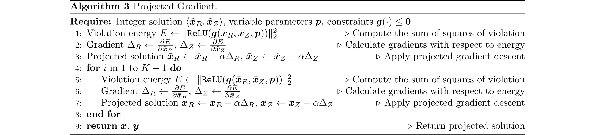
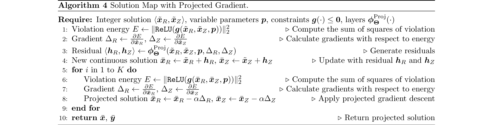

# Learning to Optimize for Mixed-Integer Nonlinear Programming


Mixed-integer nonlinear programs (MINLPs) arise in various domains, such as energy systems and transportation, but are notoriously difficult to solve. Recent advances in machine learning have achieved remarkable success in optimization tasks, an area known as learning to optimize. This approach includes using predictive models to generate solutions for optimization problems with continuous decision variables, thereby avoiding the need for computationally expensive optimization algorithms. However, applying learning to MINLPs remains challenging primarily due to integer decision variables, which complicate gradient-based learning. To address this limitation, we propose two differentiable correction layers that generate integer outputs while preserving gradient information. The experiments demonstrate that the proposed learning-based approach consistently produces high-quality solutions for parametric MINLPs extremely quickly. As problem size increases, traditional exact solvers and heuristic methods struggle to find feasible solutions, whereas our approach continues to deliver reliable results. Our work extends the scope of learning-to-optimize to MINLP, paving the way for integrating integer constraints into deep learning models.

## Contribution

Our contributions are as follows:

- We study the learning-to-optimize problem in the context of parametric MINLP (pMINLP), enabling, for the first time, quick, dynamic solution generation as problem parameters change.
- We propose two novel differentiable correction layers that effectively handle the non-differentiability of integer outputs in deep learning models. Combined with a penalty method for soft constraint satisfaction, we are able to learn a neural network mapping from instance parameters to solutions through gradient-based learning. Not only does this yield an extremely fast heuristic at test time, but the method is also self-supervised and thus efficiently trainable.
- We conduct extensive experiments on three problem classes from the literature: a convex integer quadratic problem, a nonconvex integer problem, and a nonconvex mixed-integer problem. Our learning-based methods consistently yield high-quality, feasible solutions extremely fast, outperforming exact solvers and heuristics. For the largest test instances we consider, the baselines fail to produce any solutions, whereas our methods continue to generate good, feasible solutions in most instances.

## Requirements

To run this project, you will need the following libraries and software installed:

- **Python**: The project is developed using Python. Ensure you have Python 3.9 or later installed.
- **Scikit-Learn**: Useful for performing various machine learning tasks.
- **PyTorch**: Used for building and training neural network models.
- **NumPy**: Essential for numerical operations.
- **Pandas**: Useful for data manipulation and analysis.
- **Pyomo**: A Python library for optimization modeling.
- **SCIP**: A powerful solver for mathematical programming, which might need a separate installation process.
- **Neuromancer**: This project uses the Neuromancer library for differentiable programming.

## Code Structure

```
├── img                            # Image resources for the project
├── src                            # Main source code directory
│   ├── __init__.py                # Initializes the src package
│   ├── func                       # Directory for function modules
│       ├── __init__.py            # Initializes the function submodule
│       ├── layer.py               # Pre-defined neural network layers
│       ├── ste.py                 # Straight-through estimators for non-differentiable operations
│       └── rnd.py                 # Modules for differentiable and learnable rounding
│   ├── problem                    # Modules for the benchmark of constrained optimization
│       ├── __init__.py            # Initializes the problem submodule
│       ├── math_solver            # Collection of Predefined Gurobi / SCIP solvers
│           ├── __init__.py        # Initializes the mathematical solver submodule
│           ├── abc_solver.py      # Abstract base class for solver implementations
│           ├── quadratic.py       # Gurobi model for MI Convex Quadratic problem
│           ├── nonconvex.py       # SCIP model for MI Simple Nonconvex problem
│           └── rosenbrock.py      # SCIP model for MI Rosenbrock problem
│       └── neuromancer            # Collection of Predefined NeuroMANCER maps
│           ├── __init__.py        # Initializes the NeuroMANCER map submodule
│           ├── quadratic.py       # NeuroMANCER mapping for MI Convex Quadratic problem
│           ├── nonconvex.py       # NeuroMANCER mapping for MI Simple Nonconvex problem
│           └── rosenbrock.py      # NeuroMANCER mapping for MI Rosenbrock problem
│   └── utlis                      # Utility tools such as data processing and result test
│       ├── __init__.py            # Initializes the utility submodule
│       └── data.py                # Data processing file
│       └── solve_test.py          # Testing functions to evaluate optimization solution
├── run_qp.py                      # Script for training for MI Convex Quadratic problem
├── run_nc.py                      # Script for training for MI Simple Nonconvex problem
├── run_rb.py                      # Script for training for MI Rosenbrock problem
└── README.md                      # README file for the project
```

## Problem Formulation

A generic learning-to-optimize formulation for parametric mixed-integer nonlinear programming (pMINLP) is given by:

$$
\begin{align}
\min_{\Theta}  \quad &  \mathbb{E}_{{\boldsymbol \xi} \sim \mathcal{P}_{\xi}} \, {\bf f}({\bf x^{\boldsymbol \xi}}, {\boldsymbol \xi}) \\ 
\text{s.t.} \quad
& {\bf g}({\bf x^{\boldsymbol \xi}}, {\boldsymbol \xi}) \le 0, &\forall {{\boldsymbol \xi} \in \mathcal{P}_{\xi}} \\
& {\bf x^{\boldsymbol \xi}} \in  \mathbb{R}^{n_r} \times \mathbb{Z}^{n_z}, &\forall {{\boldsymbol \xi} \in \mathcal{P}_{\xi}} \\
& {\bf x^{\boldsymbol \xi}} =  \boldsymbol \psi_{\Theta}({\boldsymbol \xi}), &\forall {{\boldsymbol \xi} \in \mathcal{P}_{\xi}}
\end{align}
$$

Here, $\mathcal{P}_{\xi}$ represents the distribution over parametric MINLP instances and ${\boldsymbol \xi} \in  \mathbb{R}^{n_{\xi}} $ is a vector of instance parameters. Vector ${\bf x^{\boldsymbol \xi}} \in \mathbb{R}^{n_r} \times \mathbb{Z}^{n_z}$ represents the mixed-integer decision variables for parameters ${\boldsymbol \xi}$. The mapping $\boldsymbol{\psi}_{\Theta}({\boldsymbol \xi})$ is a neural network with weights $\Theta$ that outputs a parametric solution ${\bf  x^{\boldsymbol \xi}}$ for parameters ${\boldsymbol \xi}$. The goal is to find the neural network weights that minimize the expected objective function value over the parameter distribution, subject to the constraints. Note that $\bf{g}(\cdot)$ is a vector-valued function representing one or more inequality constraints. As is typical in MINLP, we assume that the objective and constraint functions are differentiable.

## Algorithms

### Rounding

These algorithms provide mechanisms for rounding within a differentiable programming framework, addressing the challenge of non-differentiable operations inherent in discrete optimization. They are crucial in scenarios where solutions must adhere to integer output with constraints.

The algorithm starts with a relaxed solution $\mathbf{x}^i_R, \mathbf{x}^i_Z$ which may come from a mathematical solver or a NeuroMANCER map, providing a baseline for further refinement. Correction layers then adjust this relaxed solution via rounding the integer variables $\mathbf{x}^i_Z$ and updating continuous variables $\mathbf{x}^i_R$ to minimize the Langrage penalty function.

During the training of neural networks, non-differentiable operations such as binarization, flooring, and indicator functions pose significant challenges for gradient-based optimization methods because these functions lost gradients. To avoid these issues, the straight-through estimator (STE) is employed. This approach allows the gradient of a rounded result to pass through unaltered from its input, effectively enabling optimization of functions that involve non-differentiable transformations.

#### Learnable Binarized Rounding


This algorithm is specifically designed to adaptively decide the rounding direction—whether to round up (ceiling) or down (floor)—for each variable based on the contextual data it processes.

The `diffGumbelBinarize`, as implemented, utilizes the Gumbel-Softmax distribution to introduce two Gumbel noises into the logits of 0 and 1 during the training. This approach simulates the randomness associated with rounding decisions, and by adjusting the `temperature` parameter, it controls the sharpness of the binarization, effectively balancing exploration and exploitation in the rounding process.

#### Rounding with Learnable Threshold


This algorithm introduces a dynamic, learnable threshold that determines the specific rounding behavior for each integer variable.

### Projection

These algorithms aim to reduce constraint violation. The projection is applied iteratively for a predefined number of steps $K$, adjusting the solution in each iteration using a step size $\alpha$.

#### Projected Gradient



This algorithm is designed to refine solutions to ensure they adhere to the defined constraints by repeatedly projecting onto a feasible region.

#### Solution Map with Projected Gradient



Extending the concept of projected gradients, this algorithm incorporates a solution mapping phase that predicts residuals used to adjust the solution before projection.

## Parametric MINLP Benchmark

### MIQP

A parametric MIQP model with both continuous variables $\mathbf{x}$ and binary variables $\mathbf{y}$ can be structured as follows:

$$
\begin{aligned}
  \underset{\boldsymbol{\mathbf{x}, \mathbf{y}}}{\min} \quad & \mathbf{c}^\top \mathbf{x} + \frac{1}{2} \mathbf{x}^\top \mathbf{Q} \mathbf{x} + \mathbf{d}^\top \mathbf{y} \\
  \text{s.t.} \quad
  & \mathbf{A} \mathbf{x} + \mathbf{E} \mathbf{y} \leq \mathbf{b} + \mathbf{F} \mathbf{\theta} \\
  & \mathbf{x} \geq \mathbf{0} \\
  & \mathbf{y} \in \{ 0, 1 \}
\end{aligned}
$$

In this formulation, the objective function is a quadratic function of $\mathbf{x}$ plus linear in both $\mathbf{x}$ and $\mathbf{y}$. The constraints involve linear combinations of these variables, while the right-hand sides are modulated by the parameter $\mathbf{\theta}$.

The fixed parameters of an example from [A multiparametric programming approach for mixed-integer quadratic engineering problems](https://www.sciencedirect.com/science/article/abs/pii/S0098135401007979), are defined as follows:

$$
\mathbf{c} = \begin{bmatrix}
    0.02 \\
    0.03
\end{bmatrix},
\quad
\mathbf{Q} = \begin{bmatrix}
    0.0196 & 0.0063 \\
    0.0063 & 0.0199
\end{bmatrix},
\quad
\mathbf{d} = \begin{bmatrix}
    -0.30 \\
    -0.31
\end{bmatrix}
$$

$$
\mathbf{b} = \begin{bmatrix}
    0.417425 \\
    3.582575 \\
    0.413225 \\
    0.467075 \\
    1.090200 \\
    2.909800 \\
    1.000000
\end{bmatrix},
\quad
\mathbf{A} = \begin{bmatrix}
    1 & 0 \\
    -1 & 0 \\
    -0.0609 & 0 \\
    -0.0064 & 0 \\
    0 & 1 \\
    0 & -1 \\
    0 & 0
\end{bmatrix};
$$

$$
\mathbf{E} = \begin{bmatrix}
    -1 & 0 \\
    -1 & 0 \\
    0 & -0.5 \\
    0 & -0.7 \\
    -0.6 & 0 \\
    -0.5 & 0 \\
    1 & 1
\end{bmatrix};
$$

$$
\mathbf{F} = \begin{bmatrix}
    3.16515 & 3.7546 \\
    -3.16515 & -3.7546 \\
    0.17355 & -0.2717 \\
    0.06585 & 0.4714 \\
    1.81960 & -3.2841 \\
    -1.81960 & 3.2841 \\
    0 & 0
\end{bmatrix}
$$

The variable parameter $\mathbf{\theta}$ follows a uniform distribution between $0$ and $1$.

### MIRosenbrock

The parametric, high-dimension, Integer, and constrained Rosenbrock problem implemented in this project serves as a rigorous testbed for evaluating the efficacy of our differentiable programming framework, in which $s$ controls the steepness of the function:

$$
\begin{aligned}
  \underset{\boldsymbol{\mathbf{x}}}{\min} \quad & \sum_{i=1}^b [{(a - x_i)}^2 + s {(y_i - x_i^2)}^2] \\
  \text{s.t.} \quad
  & \sum_{i=1}^b y_i \geq \frac{b p}{2} \\
  & \sum_{i=1}^b x_i^2 \leq b p \\
  & \mathbf{x} \in \mathbb{R}^{b}, \mathbf{y} \in \mathbb{Z}^{b} \\
\end{aligned}
$$

The scalar parameter $p$ is uniformly distributed between $1$ and $8$, while the vector parameter $\mathbf{a}$, with length $b$, uniformly ranges from  $0.5$ and $4.5$.

## Example

### Rounding

Here is a simple example demonstrating learnable rounding within a neural network framework:

```Python
# get objective function & constraints
from src.problem import nmQuadratic
obj, constrs = nmQuadratic(["x_rnd"], ["p"], penalty_weight=10)

# define neural architecture for the solution map
import neuromancer as nm
func = nm.modules.blocks.MLP(insize=2, outsize=4, bias=True,
                             linear_map=nm.slim.maps["linear"],
                             nonlin=nn.ReLU, hsizes=[10]*4)
smap = nm.system.Node(func, ["p"], ["x"], name="smap")

# define rounding model using Gumbel binarization
from src.func.layer import netFC
layers_rnd = netFC(input_dim=6, hidden_dims=[20]*3, output_dim=4)
from src.func.rnd import roundGumbelModel
round_func = roundGumbelModel(layers=layers_rnd, param_keys=["p"], var_keys=["x"], output_keys=["x_rnd"],
                              bin_ind={"x":[2,3]}, continuous_update=False, name="round")


# construct the complete neuromancer problem with all components
components = [smap, round_func]
loss = nm.loss.PenaltyLoss(obj, constrs)
problem = nm.problem.Problem(components, loss)
```

### Projection

Here is a simple example demonstrating learnable projection within a neural network framework:

```Python
# get objective function & constraints
from src.problem import nmQuadratic
obj_bar, constrs_bar = nmQuadratic(["x_bar"], ["p"], penalty_weight=10)
obj_rnd, constrs_rnd = nmQuadratic(["x_rnd"], ["p"], penalty_weight=10)

# define neural architecture for the solution map
import neuromancer as nm
func = nm.modules.blocks.MLP(insize=2, outsize=4, bias=True,
                             linear_map=nm.slim.maps["linear"],
                             nonlin=nn.ReLU, hsizes=[10]*4)
smap = nm.system.Node(func, ["p"], ["x"], name="smap")

# define rounding layer using Gumbel binarization
from src.func.layer import netFC
layers_rnd = netFC(input_dim=6, hidden_dims=[20]*3, output_dim=4)
from src.func.rnd import roundGumbelModel
round_func = roundGumbelModel(layers=layers_rnd, param_keys=["p"], var_keys=["x"], output_keys=["x_rnd"],
                              bin_ind={"x":[2,3]}, continuous_update=False, name="round")


# define projection layer with specified parameters
num_steps = 10
step_size = 0.1
decay = 0.1
layers_proj = netFC(input_dim=10, hidden_dims=[20]*3, output_dim=4)
from src.func.proj import solPredGradProj
proj = solPredGradProj(layers=layers_proj, constraints=constrs_bar, param_keys=["p"],
                       var_keys=["x_rnd"], output_keys=["x_bar"], num_steps=num_steps,
                       step_size=step_size, decay=decay)

# construct the complete neuromancer problem with all components
components = [smap, round_func, proj]
loss = nm.loss.PenaltyLoss(obj_bar, constrs_bar)
problem = nm.problem.Problem(components, loss, grad_inference=True)
```
