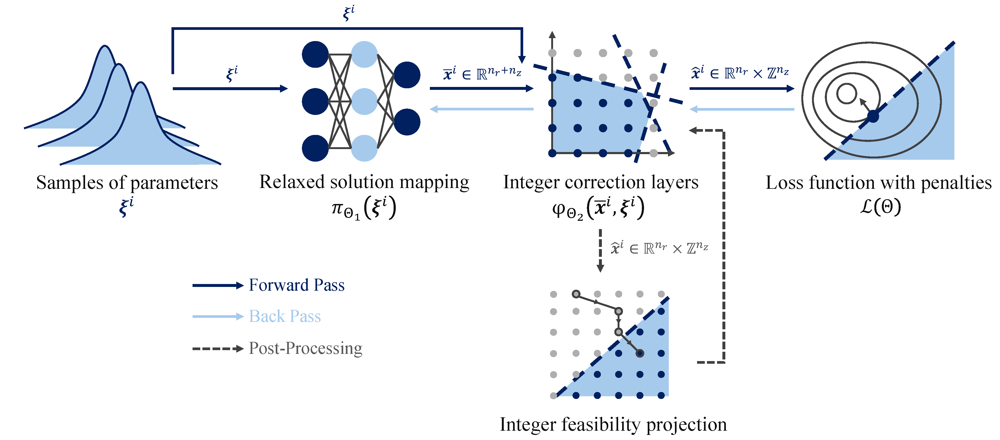
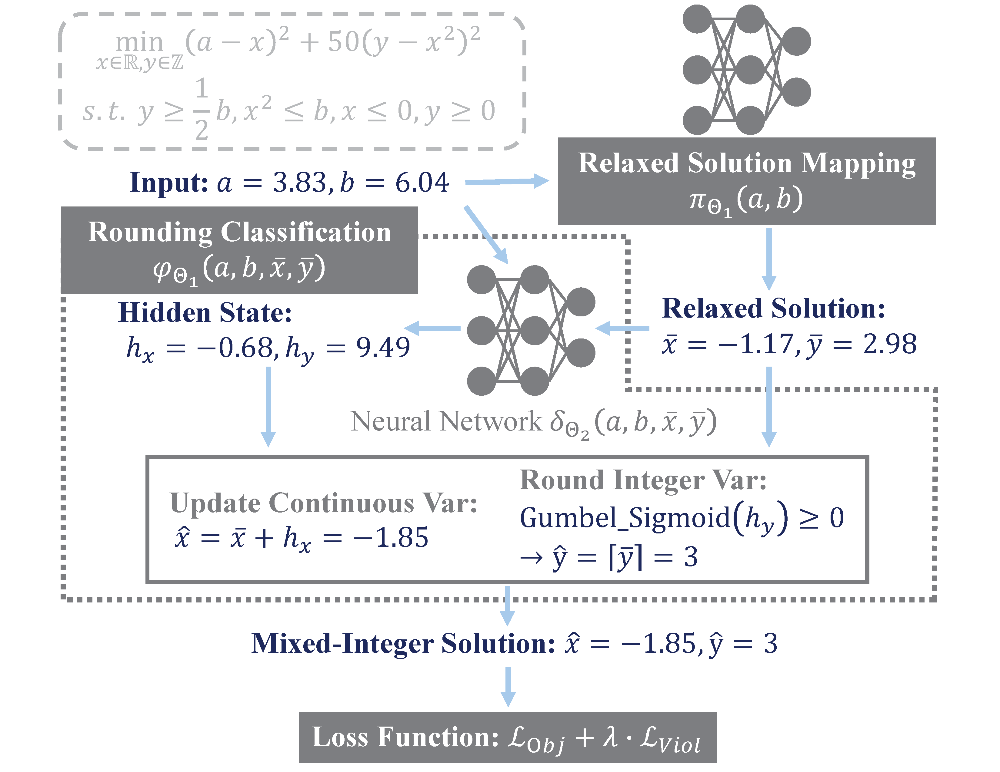
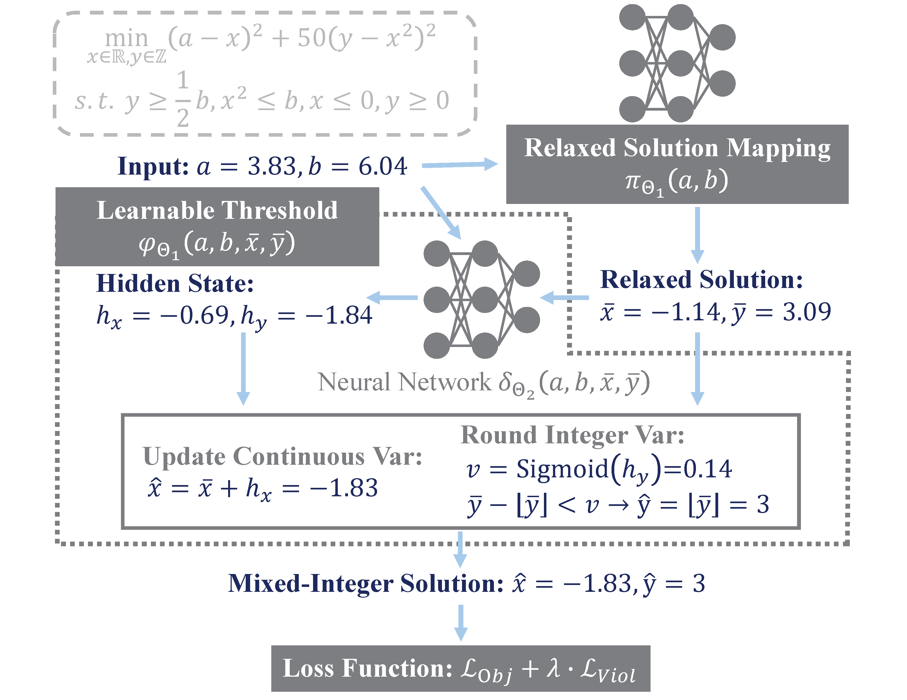
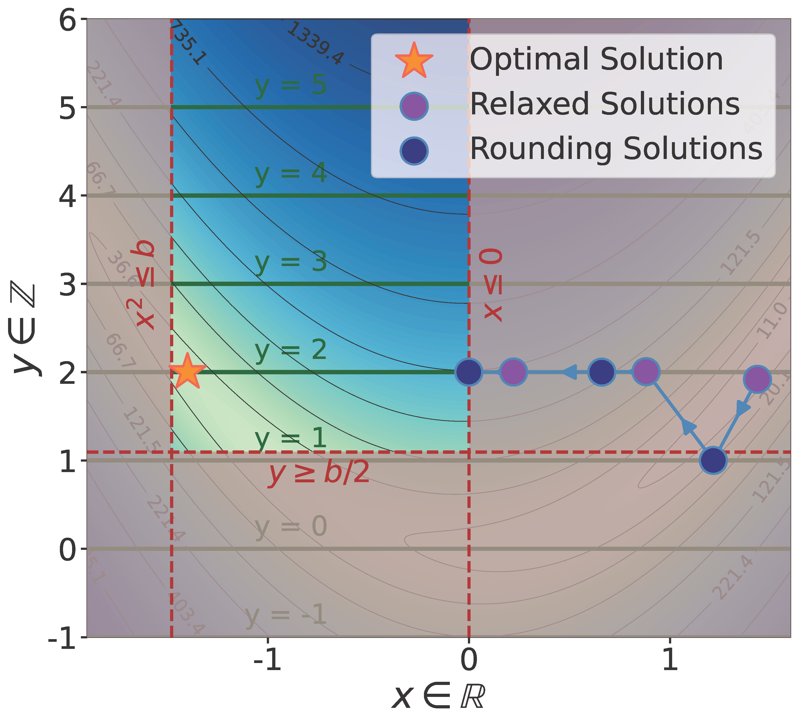
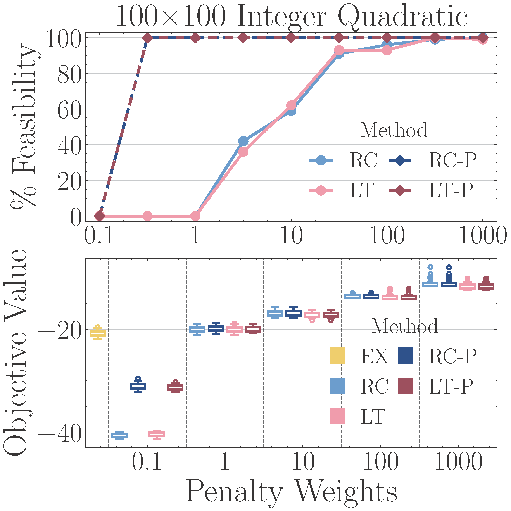
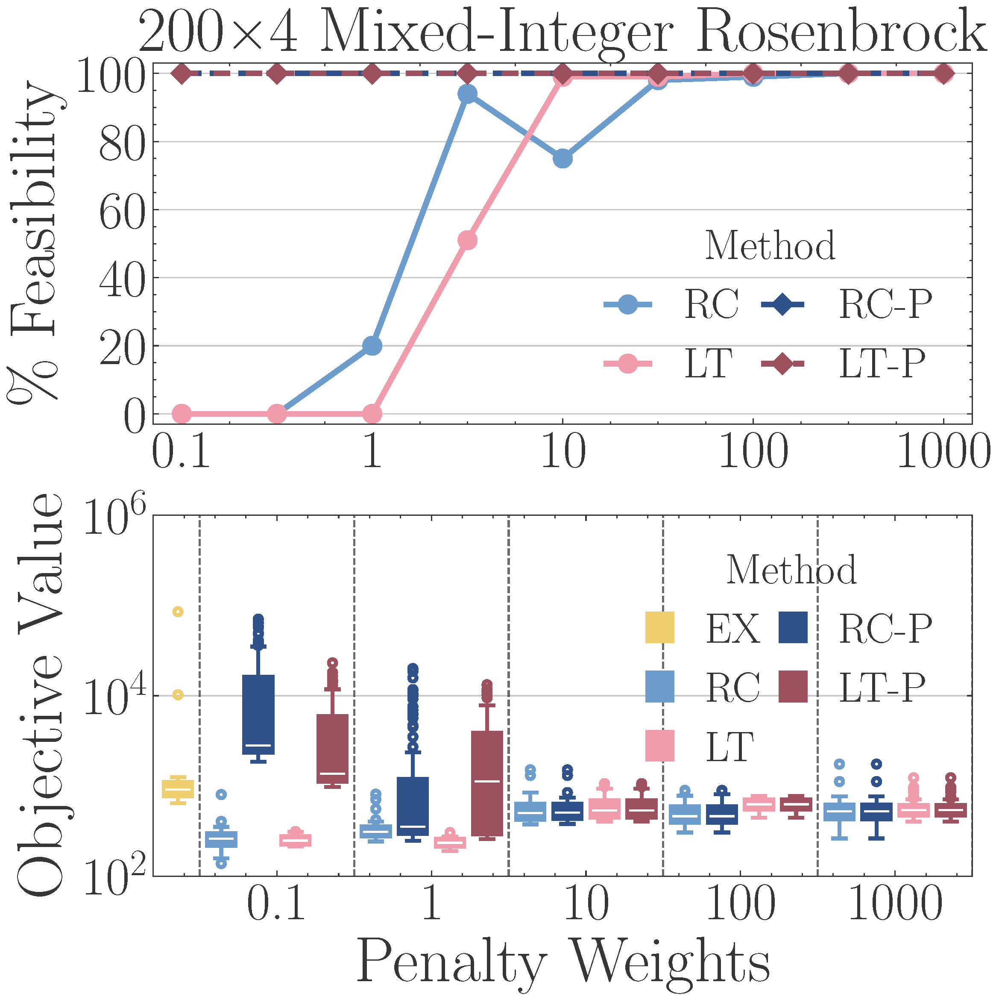

# Learning-to-Optimize for Mixed-Integer Non-Linear Programming

This repository provides the official implementation of our paper: **"[Learning to Optimize for Mixed-Integer Nonlinear Programming](https://arxiv.org/abs/2410.11061)"**




## Overview

Our approach introduces the first general Learning-to-Optimize (L2O) framework designed for Mixed-Integer Nonlinear Programming (MINLP). As illustrated above, the approach consists of two core components: **integer correction layers** and **integer feasibility projection**. 

Traditional solvers struggle with large-scale MINLPs due to combinatorial complexity and non-convexity. With up to **tens of thousands of discrete variables**, traditional solvers and heuristics even fail to find a feasible solution. Our framework leverages deep learning to predict high-quality solutions with an orders-of-magnitude speedup, enabling optimization in scenarios where exact solvers fail.


## Key Features

- 🤖 **Self-supervised learning**: Eliminates the need for optimal solutions as labels.
- 🔢 **Efficient integer correction**: Ensures integer feasibility through a learnable correction layer.
- 🎯 **Efficient feasibility correction**: Refine constraints violation via a gradient-based post-processing.
- 🚀 **Scalability**: Handles problems with up to **20,000 variables** within subsecond inference.  


## Citation

```
@article{tang2024learning,
  title={Learning to Optimize for Mixed-Integer Non-linear Programming},
  author={Tang, Bo and Khalil, Elias B and Drgo{\v{n}}a, J{\'a}n},
  journal={arXiv preprint arXiv:2410.11061},
  year={2024}
}
```

## Slides
Our recent talk will be at the ICS 2025. You can view the talk slides [here](https://github.com/pnnl/L2O-pMINLP/blob/master/slides/L2O-MINLP.pdf).

## Methodology

Our approach introduces two key components:

### Integer Correction Layers

We design two learnable integer correction layers to enforce integrality in the neural network output. The figures below illustrate the workflow of integer rounding correction.

<div align="center">
    
    
</div>

- **Rounding Classification (RC)**: Learns a classification strategy to determine rounding directions for integer variables.
- **Learnable Thresholding (LT)**: Learns a threshold value for each integer variable to decide whether to round up or down.


### Integer Feasibility Projection

While the correction layers enforce integer constraints, feasibility with respect to problem constraints is not guaranteed. We introduce a gradient-based projection that iteratively refines infeasible solutions. The figure below illustrates how the projection step adjusts a solution over multiple iterations.

<div align="center">  </div>

By integrating feasibility projection with our integer correction layers, we extend RC and LT into RC-P and LT-P, respectively. These extended methods leverage the projection step to correct infeasibilities while preserving the advantages of fast inference and high-quality integer solutions.


## Performance Comparison

Our learning-based methods (RC & LT) achieve comparable or even superior performance to exact solvers (EX) while being orders of magnitude faster. The figures below illustrate the impact of penalty weights on feasibility and objective values for smaller-scale problems:

<div align="center">
    
    
</div>

The top plots show the proportion of feasible solutions, while the bottom plots display objective values. For these instances, EX finds the best feasible solutions within **1000 seconds** (leftmost boxplot in the bottom plots), serving as a benchmark. With properly tuned penalty weights, our approach attains **comparable or better objective values within just subsecond**, demonstrating its efficiency and effectiveness.


## Requirements

To run this project, you will need the following libraries and software installed:

- **[Python](https://www.python.org):** The project is developed using Python. Ensure you have Python 3.9 or later installed.
- **[PyTorch](https://pytorch.org):** an open source deep learning (ML) framework for creating deep neural networks.
- **[Scikit-Learn](https://scikit-learn.org/stable):** an open-source machine learning library for the Python programming language.
- **[NeuroMANCER](https://pnnl.github.io/neuromancer):** an open-source differentiable programming (DP) library for parametric constrained problems.
- **[Pyomo](https://www.pyomo.org):** a Python-based open-source optimization modeling language for  mathematical programming.
- **[Gurobi](https://www.gurobi.com):** a state-of-the-art solver for mathematical programming.
- **[SCIP](https://www.scipopt.org):** a fast non-commercial solvers for mixed-integer linear and non-linear programming (MILP/MINLP).
- **[IPOPT](https://coin-or.github.io/Ipopt):** an open source software package for large-scale nonlinear optimization.
- **[NumPy](https://numpy.org):** a library to support high-level mathematical operations for large, multi-dimensional arrays and matrices.
- **[Pandas](https://pandas.pydata.org):** a fast, powerful, flexible and easy to use open source data analysis and manipulation tool.
- **[tqdm](https://tqdm.github.io):** a Python library that provides a fast, extensible progress bar for loops and iterables.


## Code Structure

```
├── test                           # Some testing and visualization with Jupyter notebooks
├── img                            # Image resources for the project
├── src                            # Main source code directory
│   ├── __init__.py                # Initializes the src package
│   ├── heuristic                  # Modules for the heuristics
│       ├── __init__.py            # Initializes the heuristics submodule
│       ├── rounding.py            # Heuristics for rounding
│       └── resolve.py             # Heuristics for resolving some problem
│   ├── func                       # Directory for function modules
│       ├── __init__.py            # Initializes the function submodule
│       ├── layer.py               # Pre-defined neural network layers
│       ├── ste.py                 # Straight-through estimators for non-differentiable operations
│       ├── rnd.py                 # Modules for differentiable and learnable rounding
│       └── proj.py                # Modules for differentiable and learnable projection (archived)
│   ├── postprocess                # Modules for the postprocessing
│       ├── __init__.py            # Initializes the postprocessing submodule
│       └── project.py             # postprocessing for the feasibility projection
│   ├── problem                    # Modules for the benchmark of constrained optimization
│       ├── __init__.py            # Initializes the problem submodule
│       ├── math_solver            # Collection of Predefined SCIP solvers
│           ├── __init__.py        # Initializes the mathematical solver submodule
│           ├── abc_solver.py      # Abstract base class for solver implementations
│           ├── quadratic.py       # SCIP model for Integer Quadratic Problems
│           ├── nonconvex.py       # NeuroMANCER map for Integer Non-Convex Problems
│           └── rosenbrock.py      # SCIP model for Mixed-Intger Rosenbrock Problems
│       └── neuromancer            # Collection of Predefined NeuroMANCER maps
│           ├── __init__.py        # Initializes the NeuroMANCER map submodule
│           ├── quadratic.py       # NeuroMANCER map for Integer Quadratic Problems
│           ├── nonconvex.py       # NeuroMANCER map for Integer Non-Convex Problems
│           └── rosenbrock.py      # NeuroMANCER map for Mixed-Intger Rosenbrock Problems
│   └── utlis                      # Utility tools such as data processing and result test
│       ├── __init__.py            # Initializes the utility submodule
│       └── data.py                # Data processing file
│       └── solve_test.py          # Testing functions to evaluate optimization solution
├── run_qp.py                      # Script to run experiments for Integer Quadratic Problems
├── run_nc.py                      # Script to run experiments for Integer Non-Convex Problems
├── run_rb.py                      # Script to run experiments for Mixed-Integer Rosenbrock Problems
└── README.md                      # README file for the project
```


## Reproducibility

Our framework supports three benchmark problems:

- **Integer Quadratic Problems (IQP)**: A convex quadratic objective with linear constraints and integer variables.
- **Integer Non-Convex Problems (INP)**: A more challenging variant incorporating trigonometric terms, introducing non-convexity.
- **Mixed-Integer Rosenbrock Problems (MIRB)**: A benchmark derived from the Rosenbrock function with linear and non-linear constraints.

To reproduce experiments, use the following commands:

#### Arguments

- `--size`: Specifies the problem size. Larger values correspond to more decision variables.
- `--penalty`: Sets the penalty weight for constraint violations (default: 100).
- `--project:` Enables feasibility projection as a post-processing step.

### Integer Quadratic Problems

```Python
python run_qp.py --size 5
```
### Integer Non-Convex Problems

```Python
python run_nc.py --size 10 --penalty 1 --project
```
### Mixed-Integer Rosenbrock Problems

```Python
python run_rb.py --size 100 --penalty 10 --project
```
